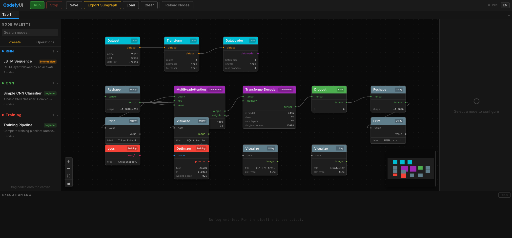

# CodefyUI

[](./docs/README_zh-TW.md)

A visual, node-based deep learning pipeline builder. Design CNN, RNN, Transformer, and RL architectures by dragging nodes onto a canvas, connecting them into a DAG, and executing the pipeline — all from the browser.



## Features

- **Visual Graph Editor** — Drag-and-drop nodes, connect ports with type-safe edges, real-time validation
- **63 Built-in Nodes** across 12 categories (CNN, RNN, Transformer, RL, Data, Data Flow, Training, IO, Control, Utility, Normalization, Tensor Operations)
- **Teaching Inspector** — Record full per-node outputs, inspect input→output tensor diffs side-by-side, and wrap a subgraph with the **Compare Segment** bubble to focus on just head-input vs tail-output. Drop in a `TensorInput` node with an inline grid editor to feed the pipeline and watch each transformation
- **Preset System** — Pre-built model templates for quick start; export your own subgraphs as reusable presets
- **Multi-Tab Workspace** — Multiple independent canvases, each with its own execution context
- **WebSocket Execution** — Real-time per-node progress, Print node output displayed in the Execution Log panel
- **Partial Re-Execution** — Dirty node tracking: only re-runs changed nodes and their downstream dependencies
- **Quick Node Search** — Double-click the canvas to open an instant search panel for adding nodes and presets
- **Custom Node Manager** — GUI for uploading, enabling/disabling, and deleting custom nodes
- **Model File Management** — Upload, list, and delete model weight files (.pt, .pth, .safetensors, .ckpt, .bin) via REST API
- **CLI Graph Runner** — Execute graph.json directly from the command line with `run_graph.py`
- **Results Panel** — Tabbed panel (Execution Log / Training), resizable, with live loss chart
- **i18n** — English and 繁體中文, with responsive `rem`-based font sizing
- **Persistence** — Auto-saves all tabs to `localStorage`; import/export graph JSON files
- **Dark Theme** — Fully styled dark UI with color-coded categories

## Quick Start

**One-liner install**:

```bash
# macOS / Linux
curl -fsSL https://raw.githubusercontent.com/treeleaves30760/CodefyUI/main/install.sh | bash
```

```powershell
# Windows (PowerShell)
powershell -ExecutionPolicy ByPass -c "irm https://raw.githubusercontent.com/treeleaves30760/CodefyUI/main/install.ps1 | iex"
```

Automatically installs git, Node.js, pnpm, uv if missing (Python is provided by uv — no separate install needed), and puts a `cdui` launcher on your PATH. After install, **open a new terminal** and run from anywhere:

```bash
cdui dev
```

Open [http://localhost:5173](http://localhost:5173). The frontend proxies API/WS requests to the backend at `:8000`.

| Command | Description |
|---------|-------------|
| `cdui install` | Install backend + frontend dependencies |
| `cdui update` | Pull latest `main` and reinstall dependencies |
| `cdui dev` | Start backend :8000 + frontend :5173 |
| `cdui stop` | Stop all services |
| `cdui test` | Run backend tests |
| `cdui clean` | Remove virtualenv and `node_modules` |
| `cdui uninstall` | Clean + remove the PATH launcher |

> `cdui` is a thin launcher (`cdui.cmd` on Windows) placed at `~/.local/bin/cdui` by the installer. If you didn't restart your terminal yet, invoke the absolute path: `~/CodefyUI/cdui dev`. `python scripts/dev.py <cmd>` still works too — `dev.py` re-execs into the venv's Python automatically.

> This quick start assumes an **NVIDIA GPU with CUDA 12.4**. For CPU, Apple Silicon, AMD, or detailed troubleshooting, see the [full setup guide](./docs/SETUP.md).

### CLI Execution

Run a graph directly from the command line without starting the server:

```bash
cd backend
python run_graph.py ../examples/Usage_Example/CNN-MNIST/TrainCNN-MNIST/graph.json
python run_graph.py ../examples/Model_Architecture/ResNet-SkipConnection-CNN/graph.json --validate-only
```

## Architecture

```
frontend/   React 19 · TypeScript · React Flow 12 · Zustand 5 · Vite 6
backend/    Python 3.10+ · FastAPI · PyTorch
```

| Principle | Detail |
|-----------|--------|
| **Backend-authoritative** | `GET /api/nodes` returns all node definitions. Adding a backend node auto-appears in the UI. |
| **Single BaseNode component** | One React component renders all node types, parameterized by backend definitions. |
| **WebSocket execution** | `ws://host/ws/execution` streams per-node status. REST handles graph CRUD. |
| **Topological execution** | Kahn's algorithm for DAG sort + cycle detection. Parallel execution of independent nodes. |

## Built-in Nodes

| Category | Nodes | Count |
|----------|-------|-------|
| **CNN** | Conv2d, Conv1d, ConvTranspose2d, MaxPool2d, AvgPool2d, AdaptiveAvgPool2d, BatchNorm2d, Dropout, Activation | 9 |
| **RNN** | LSTM, GRU | 2 |
| **Transformer** | MultiHeadAttention, TransformerEncoder, TransformerDecoder | 3 |
| **RL** | DQN, PPO, EnvWrapper | 3 |
| **Data** | Dataset, DataLoader, Transform, HuggingFaceDataset, KaggleDataset, TensorInput | 6 |
| **Data Flow** | Map, Reduce, Switch | 3 |
| **Training** | Optimizer, Loss, TrainingLoop, LRScheduler, SequentialModel | 5 |
| **IO** | ImageReader, ImageWriter, ImageBatchReader, FileReader, CheckpointSaver, CheckpointLoader, ModelLoader, ModelSaver, Inference | 9 |
| **Control** | Start | 1 |
| **Utility** | Print, Reshape, Concat, Flatten, Linear, Visualize, Embedding | 7 |
| **Normalization** | BatchNorm1d, LayerNorm, GroupNorm, InstanceNorm2d | 4 |
| **Tensor Operations** | Add, MatMul, Mean, Multiply, Permute, Softmax, Split, Squeeze, Stack, TensorCreate, Unsqueeze | 11 |

## Examples

Pre-built example workflows organized in `examples/`:

| Category | Examples |
|----------|----------|
| **Model Architecture** | ResNet, ConvNeXt, EfficientNet, UNet, ViT, SwinTransformer, BERT, GPT, LLaMA, DiT, LSTM TimeSeries, BiGRU SpeechRecognition, Seq2Seq Attention, DQN Atari, PPO Robotics |
| **Usage Example** | CNN-MNIST Training, CNN-MNIST Inference |

## Teaching Inspector

CodefyUI can be used as an interactive lesson — students see the exact tensor that flows through every node.

1. Drag a **TensorInput** node onto the canvas (Data category). Set `value_mode: explicit` and fill the inline grid with the numbers you want the pipeline to see.
2. Wire it through any chain of tensor-op nodes (e.g. `Reshape → Softmax → Print`).
3. **Drag a `Start` node onto the canvas and connect its trigger output (the diamond handle on the right side of the Start node) to the first node you want executed — typically the `TensorInput`.** Without a Start → first-node trigger edge the graph is a draft and `Run` will reject it with a *"No start node defined"* toast. Only nodes reachable from a Start are executed.
4. With the toolbar **Rec ON**, click **Run**. Every completed node's full output is captured in server memory, keyed by the run.
5. Click any node — the right-hand **Inspector** panel fetches that node's input and output, showing shape, dtype, min/max/mean and the actual values stacked top-to-bottom. Cells that changed are heat-coloured.
6. Shift-select two nodes and click **Compare Segment** to focus on just the head-input and tail-output; the canvas wraps them in a light-orange bubble with **HEAD** / **TAIL** badges so the scope is obvious.
7. Turn **Rec OFF** before a heavy training run if you don't want each epoch captured — previously captured runs stay fetchable until the server restarts.

Captured data is per-session RAM (LRU, last 20 runs). Segment markers are saved with the graph JSON.

## Custom Nodes

Drop a `.py` file in `backend/app/custom_nodes/` extending `BaseNode`:

```python
from app.core.node_base import BaseNode, DataType, PortDefinition

class MyNode(BaseNode):
    NODE_NAME = "MyNode"
    CATEGORY = "Custom"
    DESCRIPTION = "Does something"

    @classmethod
    def define_inputs(cls):
        return [PortDefinition(name="input", data_type=DataType.TENSOR)]

    @classmethod
    def define_outputs(cls):
        return [PortDefinition(name="output", data_type=DataType.TENSOR)]

    def execute(self, inputs, params):
        return {"output": inputs["input"]}
```

Hot-reload via `POST /api/nodes/reload` or the **Reload Nodes** button in the toolbar. Or use the **Custom Node Manager** GUI to upload, enable/disable, and delete custom nodes.

## Key Bindings

| Action | Key |
|--------|-----|
| Delete node | `Delete` |
| Multi-select | `Shift` + click |
| Quick add node | Double-click canvas |
| Rename node | Right-click → Rename |
| Duplicate node | Right-click → Duplicate |
| Undo | `Ctrl/Cmd` + `Z` |
| Redo | `Ctrl/Cmd` + `Shift` + `Z` / `Ctrl/Cmd` + `Y` |
| Copy nodes | `Ctrl/Cmd` + `C` |
| Paste nodes | `Ctrl/Cmd` + `V` |
| Auto Layout | `Shift` + `L` |
| Show shortcuts | `?` |

## API Endpoints

| Endpoint | Method | Description |
|----------|--------|-------------|
| `/api/nodes` | GET | List all node definitions |
| `/api/nodes/{node_name}` | GET | Get a single node definition |
| `/api/nodes/reload` | POST | Hot-reload all nodes |
| `/api/presets` | GET | List preset definitions |
| `/api/presets/{name}` | GET | Get a single preset definition |
| `/api/presets/create` | POST | Create a new preset from selected nodes |
| `/api/graph/validate` | POST | Validate a graph |
| `/api/graph/save` | POST | Save a graph |
| `/api/graph/load/{name}` | GET | Load a saved graph |
| `/api/graph/list` | GET | List saved graphs |
| `/api/graph/export` | POST | Export graph as Python script |
| `/api/examples/list` | GET | List example graphs |
| `/api/examples/load` | GET | Load an example graph |
| `/api/custom-nodes` | GET | List custom nodes |
| `/api/custom-nodes/upload` | POST | Upload a custom node |
| `/api/custom-nodes/toggle` | POST | Enable/disable a custom node |
| `/api/custom-nodes/{filename}` | DELETE | Delete a custom node |
| `/api/models` | GET | List uploaded model files |
| `/api/models/upload` | POST | Upload a model weight file |
| `/api/models/{filename}` | DELETE | Delete a model file |
| `/api/execution/outputs/{run_id}` | GET | List ports captured for a run |
| `/api/execution/outputs/{run_id}/{node_id}/{port}` | GET | Fetch a captured tensor (supports `?slice=0,:,:`) |
| `/api/execution/outputs/{run_id}` | DELETE | Clear a captured run |
| `/ws/execution` | WebSocket | Real-time graph execution (accepts `run_id`, `record_outputs`) |

## Tests

```bash
cd backend
source .venv/bin/activate
pytest tests/ -v
```

## License

MIT
