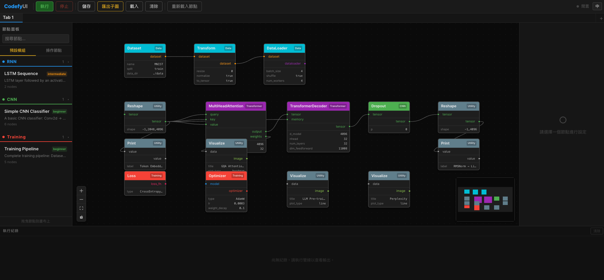

# CodefyUI

[](./README.md)

視覺化、節點式的深度學習管線建構工具。透過拖曳節點到畫布上，連接成 DAG，直接在瀏覽器中設計 CNN、RNN、Transformer 和 RL 架構並執行管線。



## 功能特色

- **視覺化圖形編輯器** — 拖放節點、型別安全的連線、即時驗證
- **33 個內建節點**，涵蓋 9 大類別（CNN、RNN、Transformer、RL、資料、訓練、IO、控制、工具）
- **預設模組系統** — 內建模型模板（簡易 CNN、LSTM 序列、訓練管線）快速開始；可將畫布匯出為可重用的預設模組
- **多分頁工作區** — 多個獨立畫布，各自擁有獨立的執行環境；切換分頁不會中斷正在執行的管線
- **WebSocket 即時執行** — 即時顯示每個節點的進度，Print 節點的輸出會顯示在執行紀錄面板
- **多語言支援** — 英文與繁體中文，使用響應式 `rem` 字型大小
- **自動儲存** — 所有分頁自動存入 `localStorage`；支援匯入/匯出 graph JSON 檔案
- **自訂節點** — 放入 Python 檔案，熱重載，即時出現在 UI
- **深色主題** — 完整的深色 UI，類別以顏色區分

## 快速開始

```bash
# 後端
cd backend
python3 -m venv .venv && source .venv/bin/activate
pip install -e ".[dev]"       # 核心 + 測試相依套件
pip install -e ".[ml]"        # PyTorch、torchvision、gymnasium（執行管線時需要）
uvicorn app.main:app --reload

# 前端（另開終端）
cd frontend
pnpm install
pnpm dev
```

開啟 [http://localhost:5173](http://localhost:5173)。前端會將 API/WS 請求代理到後端的 `:8000` 埠。

## 架構

```
frontend/   React 19 · TypeScript · React Flow 12 · Zustand 5 · Vite 6
backend/    Python 3.10+ · FastAPI · PyTorch
```

| 原則 | 說明 |
|------|------|
| **後端權威** | `GET /api/nodes` 回傳所有節點定義。後端新增節點後 UI 自動出現。 |
| **單一 BaseNode 元件** | 一個 React 元件渲染所有節點類型，由後端定義參數化。 |
| **WebSocket 執行** | `ws://host/ws/execution` 串流每個節點的狀態。REST 處理圖表 CRUD。 |
| **拓撲排序執行** | 使用 Kahn 演算法進行 DAG 排序 + 循環偵測。 |

## 內建節點

| 類別 | 節點 |
|------|------|
| **CNN** | Conv2d、MaxPool2d、BatchNorm2d、Dropout、Activation |
| **RNN** | LSTM、GRU |
| **Transformer** | MultiHeadAttention、TransformerEncoder、TransformerDecoder |
| **RL** | DQN、PPO、EnvWrapper |
| **資料** | Dataset、DataLoader、Transform |
| **訓練** | Optimizer、Loss、TrainingLoop |
| **IO** | ImageReader、ImageWriter、ImageBatchReader、FileReader、ModelSaver、ModelLoader、CheckpointSaver、CheckpointLoader、Inference |
| **控制** | If、ForLoop、Compare |
| **工具** | Print、Reshape、Concat、Flatten、Linear、SequentialModel、Visualize |

## 預設模組

開箱即用的模型模板：

- **Simple CNN Classifier** — Conv2d → ReLU → MaxPool → Flatten → Linear
- **LSTM Sequence** — LSTM 接激活層
- **Training Pipeline** — 完整的 Dataset → DataLoader → Optimizer → Loss → TrainingLoop

透過工具列的 **匯出子圖** 按鈕，可以將目前的畫布匯出為可重用的預設模組。

## 使用已訓練的模型進行推論

訓練完成後，可以將模型權重儲存下來，之後載入並用 **Inference** 節點進行推論。

### 儲存模型權重

訓練完成後，將 **TrainingLoop** 的 `model` 輸出連接到 **ModelSaver** 節點：

```
SequentialModel → Optimizer → TrainingLoop → ModelSaver
                                   ↑
                              DataLoader
                              Loss
```

ModelSaver 會將權重存為 `.pt` 檔案，預設位置為 `backend/app/data/models/`。

### 上傳已訓練的模型權重

如果你有在外部訓練好的 `.pt` / `.pth` 權重檔，將檔案放入：

```
backend/app/data/models/
```

然後在 **ModelLoader** 節點的 `path` 參數填入檔名即可（例如 `my_weights.pt`）。

> 也可以填入絕對路徑，指向系統上任意位置的權重檔。

### 推論流程

使用 **Inference** 節點對新資料進行預測：

**方式一：state_dict 模式**（推薦 — 需要同樣的模型架構）

```
SequentialModel ──→ ModelLoader ──→ Inference ──→ output（預測結果）
                        ↑               ↑
                   my_weights.pt    輸入資料（Tensor）
```

**方式二：full_model 模式**（不需要 SequentialModel 節點）

```
ModelLoader（load_mode=full_model）──→ Inference ──→ output（預測結果）
                  ↑                        ↑
             my_model.pt              輸入資料（Tensor）
```

Inference 節點會自動將模型設為 `eval()` 模式並在 `torch.no_grad()` 下執行前向傳播。

## 自訂節點

將 `.py` 檔案放入 `backend/app/custom_nodes/`，繼承 `BaseNode`：

```python
from app.core.node_base import BaseNode, DataType, PortDefinition

class MyNode(BaseNode):
    NODE_NAME = "MyNode"
    CATEGORY = "Custom"
    DESCRIPTION = "自訂節點"

    @classmethod
    def define_inputs(cls):
        return [PortDefinition(name="input", data_type=DataType.TENSOR)]

    @classmethod
    def define_outputs(cls):
        return [PortDefinition(name="output", data_type=DataType.TENSOR)]

    def execute(self, inputs, params):
        return {"output": inputs["input"]}
```

透過 `POST /api/nodes/reload` 或工具列的 **重新載入節點** 按鈕進行熱重載。

## 快捷鍵

| 操作 | 按鍵 |
|------|------|
| 刪除節點 | `Delete` |
| 多選 | `Shift` + 點擊 |
| 重新命名節點 | 右鍵 → 重新命名 |
| 複製節點 | 右鍵 → 複製 |

## 測試

```bash
cd backend
source .venv/bin/activate
pytest tests/ -v
```

## 授權

MIT
